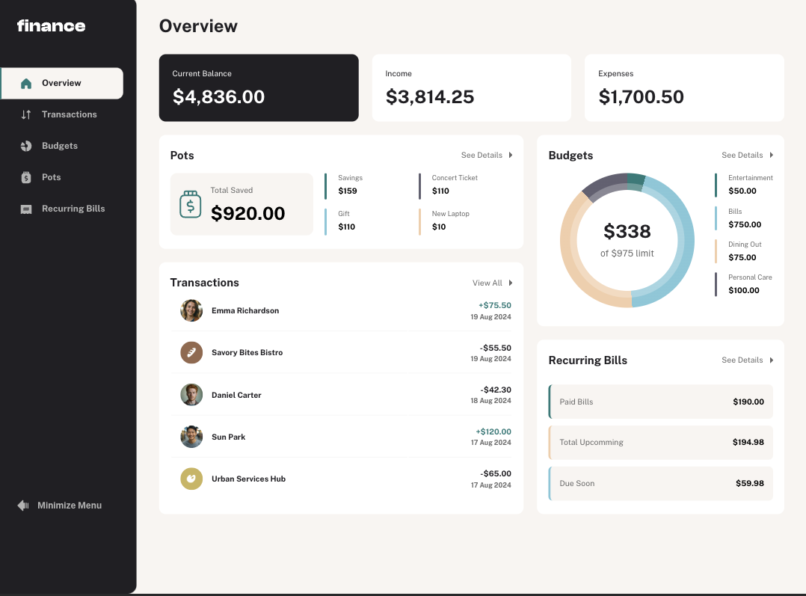

# Frontend Mentor - Personal finance app solution

This is a solution to the [Personal finance app challenge on Frontend Mentor](https://www.frontendmentor.io/challenges/personal-finance-app-JfjtZgyMt1). Frontend Mentor challenges help you improve your coding skills by building realistic projects.

## Table of contents

- [Overview](#overview)
  - [The challenge](#the-challenge)
  - [Screenshot](#screenshot)
  - [Links](#links)
- [My process](#my-process)

  - [Built with](#built-with)
  - [What I learned](#what-i-learned)

  - [Useful resources](#useful-resources)

- [Author](#author)

## Overview

### The challenge

Users should be able to:

- See all of the personal finance app data at-a-glance on the overview page
- View all transactions on the transactions page with pagination for every ten transactions
- Search, sort, and filter transactions
- Create, read, update, delete (CRUD) budgets and saving pots
- View the latest three transactions for each budget category created
- View progress towards each pot
- Add money to and withdraw money from pots
- View recurring bills and the status of each for the current month
- Search and sort recurring bills
- Receive validation messages if required form fields aren't completed
- Navigate the whole app and perform all actions using only their keyboard
- View the optimal layout for the interface depending on their device's screen size
- See hover and focus states for all interactive elements on the page
- **Bonus**: Save details to a database (build the project as a full-stack app)
- **Bonus**: Create an account and log in (add user authentication to the full-stack app)

### Screenshot

### Links

- Solution URL: [Github repo](https://github.com/mrcordova/personal-finance-app)
- Live Site URL: [personal-finance-app](https://personal-finance-app-1.onrender.com)

## My process

### Built with

- Semantic HTML5 markup
- CSS custom properties
- Flexbox
- CSS Grid

### What I learned

I learned how to create a full stack app and how to deploy it. I also learned about how keep track of elements, how to sort elements and how to display them.

### Useful resources

- [Mutation Observer](https://developer.mozilla.org/en-US/docs/Web/API/MutationObserver) - How to detect changes to an element and its children that are being observed.
- [Pagination](https://www.sitepoint.com/simple-pagination-html-css-javascript/) - How to split elements into pages.
- [Table cell overflow](https://stackoverflow.com/questions/9789723/css-text-overflow-in-a-table-cell) - How to deal with text overflow in table cell.
- [Date format options](https://developer.mozilla.org/en-US/docs/Web/JavaScript/Reference/Global_Objects/Intl/DateTimeFormat/DateTimeFormat#options) - Documentation on the display options for the Date object.
- [Sort object by date](https://stackoverflow.com/questions/10123953/how-to-sort-an-object-array-by-date-property) - How to sort object by a property.
- [Ellipis placeholder](https://stackoverflow.com/questions/10556365/is-it-possible-to-ellipsize-placeholders-watermarks-in-html5) - how to use ellipis in input placeholder text.
- [Gradient Conic](https://developer.mozilla.org/en-US/docs/Web/CSS/gradient/conic-gradient) - I used this to create budget chart.
- [Swap dom child nodes](https://stackoverflow.com/questions/9732624/how-to-swap-dom-child-nodes-in-javascript) - Use this for theme menu values.
- [Add input icon in input element](https://stackoverflow.com/questions/24369197/how-to-add-static-text-inside-an-input-form) - How to add an icon to an input element and how to position it.
- [How to insert an element in an array](https://stackoverflow.com/questions/72393049/how-to-add-a-element-in-between-array-using-const-array-in-javascript) - How to add/remove an element, I used this to remove an element when deleting from budget/pot array objects.
- [Function to check if num](https://stackoverflow.com/questions/1779013/check-if-string-contains-only-digits) - How to check if an input element only has numbers using regex.
- [Getting index of in object by property](https://stackoverflow.com/questions/7176908/how-can-i-get-the-index-of-an-object-by-its-property-in-javascript) - I used this along with the theme property to find object to modify.
- [Set of objects](https://stackoverflow.com/questions/5657219/set-of-objects-in-javascript) - How to create a set of objects.
- [How to create put request using Express](https://stackoverflow.com/questions/64420399/how-to-pass-body-to-express-router-for-put-request) - Basic setup for express put request.
- [Req body empty](https://stackoverflow.com/questions/24543847/req-body-empty-on-posts) - Express setup if req body is empty when called.
- [How to send and return json](https://stackoverflow.com/questions/10005939/how-do-i-consume-the-json-post-data-in-an-express-application) - Middleware to send json back from request.
- [Basics for CRUD project](https://www.freecodecamp.org/news/create-crud-api-project/) - Used this as the basic setup for a CRUD project.
- [MySql queries for node](https://sidorares.github.io/node-mysql2/docs/examples/queries/prepared-statements/delete) - The basics for how to make queries to use in node.
- [How to deploy frontend and backend on render.com](https://stackoverflow.com/questions/74063029/deploying-a-mern-app-to-render-com-with-one-main-folder-structure-not-separate) - How to deploy a project with a frontend and backend.
- [Responsive table](https://github.com/yesnoio/responsive-table?tab=readme-ov-file) - Used this for the transaction/recurring bills tables.
- [How to connect mySql in node](https://www.mysqltutorial.org/mysql-nodejs/connect/) - Tutorial for how to use mySql in node

- [Service to create mySql database](https://console.aiven.io/account/a4ea447f93ed/home) - The service I used to host mySql database.

## Author

- Website - [Noah C.](https://noahs.software)
- Frontend Mentor - [@mrcordova](https://www.frontendmentor.io/profile/mrcordova)
